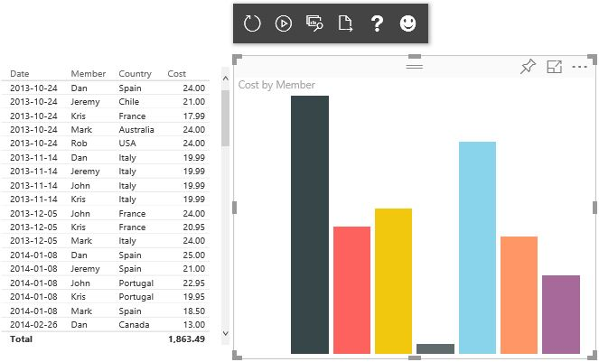
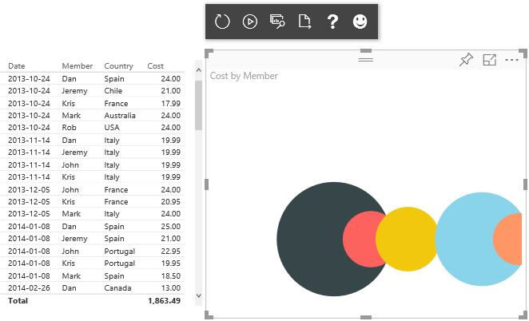
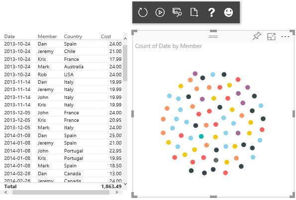
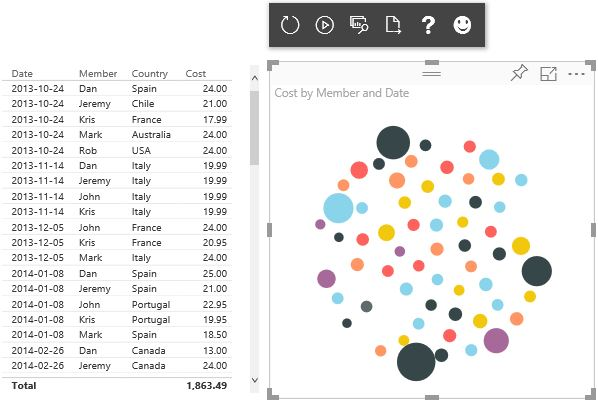

#Creating a custom Power BI Visual

This repository contains the sample code used during a talk delivered to the [Calgary PowerBI Users Group](https://yycpug.tidyhq.com/) on 2016-09-20. The agenda of the talk, with related links and other material is available [here](http://dankronstal.azurewebsites.net/pbidemo/index.html).

##Overview

These folders contain the code for samples derived from and iteratively adding to the [Sample Bar Chart Repo](https://github.com/Microsoft/PowerBI-visuals-sampleBarChart), with the intention of creating a PowerBI chart which replicates and extends my "prototype" chart, the [Group Gravity Chart](http://dankronstal.azurewebsites.net/pbidemo/samples/groupGravity.html). Code for the non-PowerBI version of this prototype is available in the "0-assets" folder.

The iterations of changes are as follows:

* Start from the sample repo:

* Update from "bar" chart to "ball" chart (SVG rects become SVG circles)

* Update from circle size per group to circle quantity per group

* Add circle size (by cost, in my example) per instance (by date, in my example)

##Further reading

There are lots of great resources available for finding inspiration, examples, and tutorials related to D3 (the default visual drawing library in PowerBI):
* [Mike](http://bl.ocks.org/mbostock) [Bostock](https://bost.ocks.org/mike/) is the creator of D3
* Many people post fresh ideas on [twitter](https://twitter.com/hashtag/d3js)
* [Thousands of other examples](http://techslides.com/over-2000-d3-js-examples-and-demos) are available too
* [Here](http://www.janwillemtulp.com/water/)(and [here](http://www.visualcinnamon.com/2015/08/stretched-chord.html), and [here](http://tulpinteractive.com/close-votes/)) are some of my favorites

Feel free to contact me at dkronstal@hitachi-solutions.com if you have any questions.